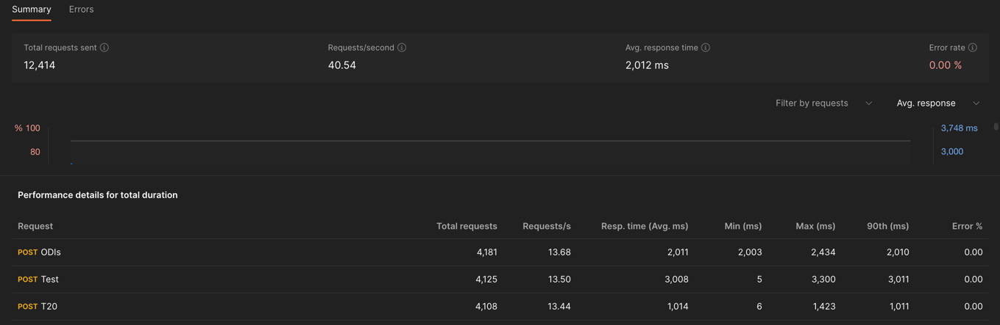
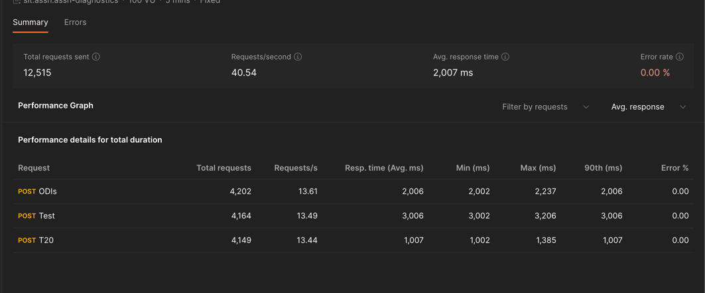

Apollo Federation 2
---------------------------------------
Explored Options to mitigate Communication Error between Gateway/Router to Subgraphs.

- Apollo Server 4
- Apollo Gateway.
- Apollo Router

Note: This project doesn't optimise subgraphs behaviour, it's focused on handling of Fedrated request to subgraphs.

#### Overview Of Services

1. Subgraphs got the fixed delay 

#### Starting Up Services
`rover supergraph compose --config supergraph-config.yaml > supergraph.graphql`

To Start Subgraph's
`npm run subgraphs`

To Start Gateway 
`npm run gateway`

To Start Router
`./router --supergraph composition/supergraph.graphql`

### 1. Gateway Based Approach - Router 4

**Encountered Error:**

Socket HangUp - INTERNAL_SERVER_ERROR.

**5 Mins WLM**

### 2. Router Based Approach

_Note: Response time < 1 sec is an occurrence of Socket hangup_

### 3. Custom Error Code Feasibility

**Custom Error Code Feasibility**

https://www.apollographql.com/docs/apollo-server/data/errors/
